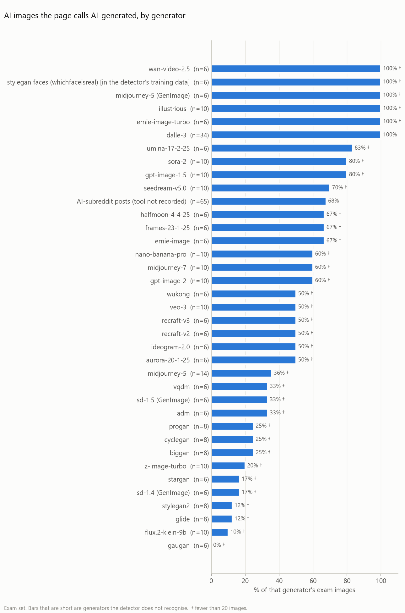
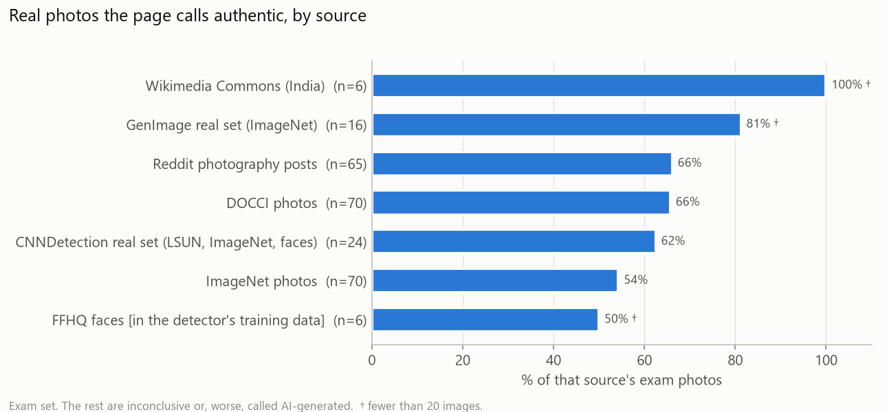
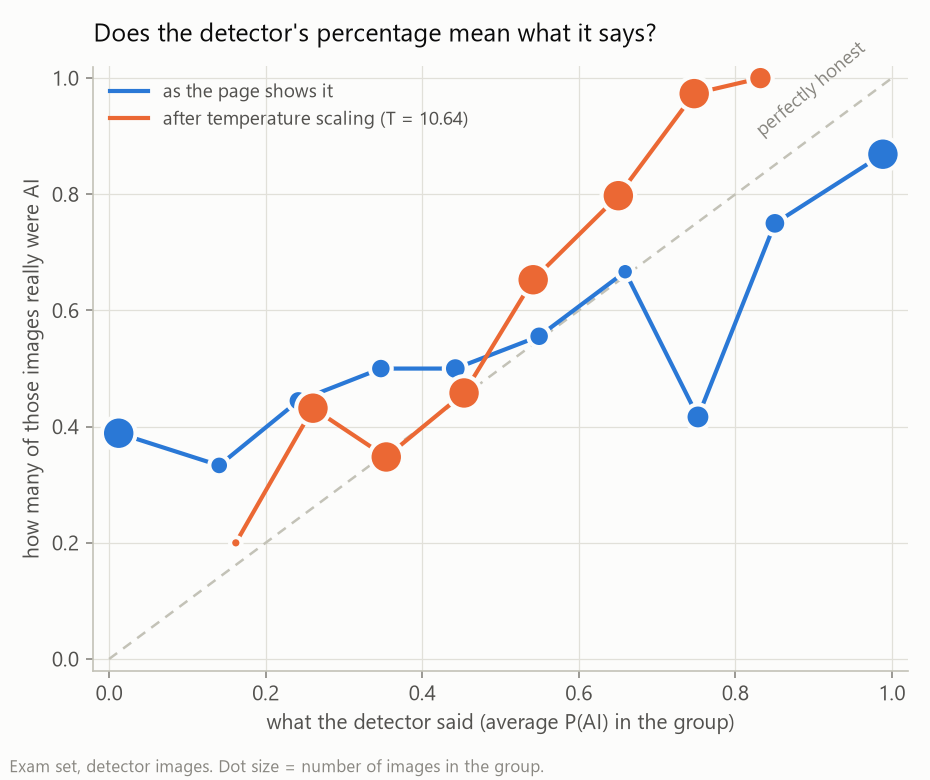

# Deep-Guard baseline — today's system on the exam (27 Sep 2026)

This is the "before" picture for the whole roadmap: what Deep-Guard's detector and source panel
score on the exam set **before** any new layer is added. Every later step is judged against these
numbers. How the exam was built: `README.md` in this folder. The full report follows the summary.

## In plain words

**The exam.** 621 labelled pictures the detector has never been tuned on — 370 AI-generated
(35 named generators, including GPT Image 2, Nano Banana Pro, Midjourney 7 and frames from
Sora 2 and Veo 3, plus 69 pictures whose tool was never recorded, mostly Reddit posts) and
251 real photos from six sources (ImageNet, DOCCI, Reddit photography, the CNNDetection and
GenImage real sets, Wikimedia Commons). Labels come from the datasets, never from us.

**1. The detector catches a little over half of today's AI images.** It calls 58% of the AI
pictures AI-generated, calls 27% of them *authentic* (a confident miss), and raises a false
alarm on 14% of real photos. Its ranking quality (AUC) is 0.76, where 1.0 is perfect and 0.5
a coin toss. It caught every DALL-E 3 picture (100%) but only 6 of 10 Midjourney 7,
6 of 10 GPT Image 2, 6 of 10 Nano Banana Pro and 1 of 10 FLUX.2 Klein pictures
(ten each, so treat those as rough). On older research generators (GANs, GLIDE, early Stable
Diffusion) it catches only 25%, against 71% on today's commercial tools.
*Analogy: a guard trained mostly on one gang's disguises recognises that gang every time, and
lets many other gangs walk past.* (91.5% of its training fakes were StyleGAN faces.)

**2. The file's size makes little difference.** The detector squashes every picture to 256×256
before looking, and a controlled test agrees: 160 modern AI images shrunk to 256 px were
caught 63% → 61%. What the exam cannot separate is *why* it misses older
generators — the generators themselves, their lossless 256-px PNGs, or their subjects — since those
all change together. Training on many generators addresses all three.

**3. Its percentages overclaim.** Of the pictures it scores below 10% AI, 39% really
are AI. Temperature scaling, fitted on the separate calibration set, needed T = 10.6 — an
extreme softening — and afterwards 593 of 621
pictures fall between 20% and 80%. So an honest version of this detector is almost never sure.
The page still shows its old verdicts; the API now reports the calibrated reading alongside, and
the trust report (Step 1) is where the verdict wording moves to calibrated numbers.

**4. The source panel ("which tool made it?") does not work on fresh pictures.** Even on the tools it
was trained on, it named the right one for only 39% of fresh images (an upper
bound — see the report), and it is *more* confident on tools it has never seen than on its own
(AUROC 0.30 on the calibration set, 0.40 on the exam — below chance). No
threshold on its confidence can fix that, so naming is switched off: it now answers "can't tell
which tool made this" for every picture, instead of a confidently wrong name for every picture from
a tool it doesn't know.

**5. Messaging-app-style copies barely matter.** A simulated WhatsApp-style re-save of 80 pictures
(≤ 1600 px, JPEG quality 75) changed the page's verdict for 3 of them. Real WhatsApp round trips
of the team's own pictures will be added through `incoming/`.

**What this means for the roadmap.** The detector's blind spots are *generators it never saw* — exactly
what Step 4 (a second detector trained on OpenFake's many generators) is for. Its overconfidence is
what Step 1's trust report must not repeat: show calibrated confidence and say "inconclusive" honestly.
And the layers that do not guess — Content Credentials (Step 2) and watermarks (Step 3) — matter
most precisely where this detector is weakest: today's commercial tools, which sign and watermark
their output.

---

## The full report

Measured 27 Sep 2026 on `4b6bf77-dirty` (step0-exam-set; "-dirty" means uncommitted changes were
present), with the detector (`deepguard_bouncer.pth`) and source panel (`deepguard_attribution.pth`)
exactly as the server runs them. The 641 detector images went through
`POST /api/analyze`, the same call the analysis page makes; the derived files (social-media copies,
watermarked files, the size test) were scored directly with the same model objects, which were checked
to give the API's answer to 4 decimal places on every one of those detector images.

### The exam

621 labelled images the detector has never been tuned on (370 AI-generated, 251 real),
plus 80 social-media-style copies, 26 Content
Credentials test images and 72 watermarked files that later steps use.
Where every image came from, with its licence and SHA-256: `evaluation/exam_set_manifest.csv`.
What the groups mean: `evaluation/README.md`.

20 further images are in the tables below but **not** in the headline, because they
may not be new to the detector (FFHQ real faces and StyleGAN faces are in its training data (Kaggle 140k-real-and-fake-faces); the project's demo images, looked at throughout development).

The page gives one of three answers: **"looks AI-generated"** (P(AI) ≥ 80%), **"inconclusive"**
(20–80%), or **"looks authentic"** (≤ 20%). The numbers below count those answers.

### Headline

| | Result |
|---|---|
| AI images the page calls AI-generated | **58%** (95% range 53–63%) |
| AI images the page calls **authentic** (confident miss) | **27%** (95% range 23–32%) |
| Real photos the page calls authentic | **64%** (95% range 58–70%) |
| Real photos the page calls **AI-generated** (false alarm) | **14%** (95% range 10–19%) |
| Inconclusive (either kind) | 18% |
| Ranking quality, AUC (1.0 = perfect, 0.5 = coin toss) | 0.762 (95% range 0.726–0.798) |
| Accuracy if the page simply split at 50% | 70% |
| Time per image (median / slowest 10%) | 0.66 s / 0.97 s |





### By where the images came from

| Group | n | Called AI-generated | Inconclusive | Called authentic |
|---|---:|---:|---:|---:|
| CNNDetection: older GANs (2017-2020) | 68 | AI 18% / real 4% | 19% | AI 70% / real 63% |
| GenImage: older diffusion models and GANs | 64 | AI 38% / real 6% | 20% | AI 40% / real 81% |
| OpenFake Reddit set: pictures as they circulate online | 130 | AI 68% / real 12% | 19% | AI 15% / real 66% |
| OpenFake test split: generators no training set contains | 300 | AI 63% / real 18% | 18% | AI 23% / real 60% |
| Our 44 outside images (DALL-E 3, MidJourney v5) | 44 | 80% | 11% | 9% |
| Wikimedia Commons pictures † | 15 | AI 100% / real 0% | 0% | AI 0% / real 100% |

### By generator (and by kind of real photo)

| Group | n | Called AI-generated | Inconclusive | Called authentic |
|---|---:|---:|---:|---:|
| AI-subreddit posts (tool not recorded) | 65 | 68% | 17% | 15% |
| adm † | 6 | 33% | 0% | 67% |
| aurora-20-1-25 † | 6 | 50% | 17% | 33% |
| biggan † | 8 | 25% | 38% | 38% |
| biggan (GenImage) † | 4 | 25% | 25% | 50% |
| cyclegan † | 8 | 25% | 0% | 75% |
| dalle-3 | 34 | 100% | 0% | 0% |
| ernie-image † | 6 | 67% | 0% | 33% |
| ernie-image-turbo † | 6 | 100% | 0% | 0% |
| flux.2-klein-9b † | 10 | 10% | 10% | 80% |
| frames-23-1-25 † | 6 | 67% | 33% | 0% |
| gaugan † | 6 | 0% | 0% | 100% |
| glide † | 8 | 13% | 0% | 88% |
| gpt-image-1.5 † | 10 | 80% | 0% | 20% |
| gpt-image-2 † | 10 | 60% | 20% | 20% |
| halfmoon-4-4-25 † | 6 | 67% | 17% | 17% |
| ideogram-2.0 † | 6 | 50% | 17% | 33% |
| illustrious † | 10 | 100% | 0% | 0% |
| lumina-17-2-25 † | 6 | 83% | 0% | 17% |
| midjourney-5 † | 14 | 36% | 36% | 29% |
| midjourney-5 (GenImage) † | 6 | 100% | 0% | 0% |
| midjourney-7 † | 10 | 60% | 20% | 20% |
| nano-banana-pro † | 10 | 60% | 30% | 10% |
| progan † | 8 | 25% | 25% | 50% |
| project's original AI images [used during development] † | 4 | 0% | 25% | 75% |
| recraft-v2 † | 6 | 50% | 17% | 33% |
| recraft-v3 † | 6 | 50% | 17% | 33% |
| sd-1.4 (GenImage) † | 6 | 17% | 67% | 17% |
| sd-1.5 (GenImage) † | 6 | 33% | 33% | 33% |
| seedream-v5.0 † | 10 | 70% | 30% | 0% |
| sora-2 † | 10 | 80% | 20% | 0% |
| stable-diffusion (version not stated) † | 1 | 100% | 0% | 0% |
| stable-diffusion-3.5 † | 1 | 100% | 0% | 0% |
| stargan † | 6 | 17% | 0% | 83% |
| stylegan (version not stated) † | 2 | 100% | 0% | 0% |
| stylegan faces (whichfaceisreal) [in the detector's training data] † | 6 | 100% | 0% | 0% |
| stylegan2 † | 8 | 13% | 0% | 88% |
| unknown † | 1 | 100% | 0% | 0% |
| veo-3 † | 10 | 50% | 10% | 40% |
| vqdm † | 6 | 33% | 33% | 33% |
| wan-video-2.5 † | 6 | 100% | 0% | 0% |
| wukong † | 6 | 50% | 33% | 17% |
| z-image-turbo † | 10 | 20% | 20% | 60% |
| real: CNNDetection real set (LSUN, ImageNet, faces) | 24 | 4% | 33% | 63% |
| real: DOCCI photos | 70 | 20% | 14% | 66% |
| real: FFHQ faces [in the detector's training data] † | 6 | 17% | 33% | 50% |
| real: GenImage real set (ImageNet) † | 16 | 6% | 13% | 81% |
| real: ImageNet photos | 70 | 16% | 30% | 54% |
| real: Reddit photography posts | 65 | 12% | 22% | 66% |
| real: Wikimedia Commons (India) † | 6 | 0% | 0% | 100% |
| real: project's original test photos [used during development] † | 4 | 0% | 25% | 75% |

† fewer than 20 images: shown, but too few to trust on their own.

### By kind of generator

| Group | n | Called AI-generated | Inconclusive | Called authentic |
|---|---:|---:|---:|---:|
| closed commercial | 122 | 71% | 15% | 14% |
| older research model | 88 | 25% | 18% | 57% |
| open weights | 32 | 47% | 9% | 44% |
| other / unknown | 102 | 70% | 15% | 16% |
| video-model frame | 26 | 73% | 12% | 15% |
| real photo | 251 | 14% | 22% | 64% |

### By image size, file format, content

| Group | n | Called AI-generated | Inconclusive | Called authentic |
|---|---:|---:|---:|---:|
| 1024-2047 px | 223 | AI 69% / real 8% | 12% | AI 19% / real 67% |
| 2048 px and over | 169 | AI 76% / real 16% | 17% | AI 5% / real 68% |
| 512-1023 px | 58 | AI 48% / real 17% | 31% | AI 24% / real 42% |
| under 512 px | 171 | AI 23% / real 11% | 22% | AI 63% / real 61% |

| Group | n | Called AI-generated | Inconclusive | Called authentic |
|---|---:|---:|---:|---:|
| JPEG | 392 | AI 64% / real 15% | 18% | AI 21% / real 64% |
| PNG | 183 | AI 45% / real 4% | 18% | AI 39% / real 63% |
| WEBP | 46 | 78% | 13% | 9% |

| Group | n | Called AI-generated | Inconclusive | Called authentic |
|---|---:|---:|---:|---:|
| image | 560 | AI 58% / real 14% | 17% | AI 27% / real 65% |
| video frame | 61 | AI 57% / real 7% | 23% | AI 26% / real 53% |

### By subject (machine-labelled by CLIP, so approximate)

| Group | n | Called AI-generated | Inconclusive | Called authentic |
|---|---:|---:|---:|---:|
| animal | 131 | AI 32% / real 15% | 24% | AI 45% / real 61% |
| art or illustration | 136 | AI 82% / real 15% | 11% | AI 8% / real 62% |
| food † | 15 | AI 92% / real 33% | 13% | AI 0% / real 33% |
| indoor scene | 23 | AI 72% / real 0% | 0% | AI 28% / real 100% |
| nature or landscape | 33 | AI 50% / real 5% | 6% | AI 36% / real 95% |
| object | 142 | AI 49% / real 18% | 25% | AI 28% / real 55% |
| people | 26 | AI 28% / real 0% | 8% | AI 67% / real 88% |
| portrait | 38 | AI 28% / real 11% | 29% | AI 48% / real 44% |
| street or buildings | 22 | AI 25% / real 7% | 9% | AI 75% / real 79% |
| text or graphic | 24 | AI 64% / real 50% | 21% | AI 18% / real 0% |
| vehicle | 31 | AI 31% / real 11% | 16% | AI 54% / real 72% |

### Does "90%" mean right 9 times in 10? (calibration)

Temperature scaling was fitted on the separate calibration set (calibration set, 372 images) and judged here.
T = **10.64** (the detector is over-confident: T above 1 softens it).

| On the exam set | As the page shows it | After temperature scaling (used by the app) | Platt scaling, a·z + b (comparison only) |
|---|---:|---:|---:|
| Expected calibration error (0 = honest) | 0.227 | 0.090 | 0.090 |
| Brier score (0 = perfect, 0.25 = always guessing 50%) | 0.259 | 0.204 | 0.198 |
| Confidently wrong verdicts (AI↔real) | 136 | 1 | 5 |
| Inconclusive verdicts | 110 | 593 | 492 |



**What this means.** The detector's percentages are far too sure of themselves: of the images it scores
below 10% AI, 39% really are AI. Once its readings are made honest, it is
almost never sure: 593 of 621 exam images land between 20% and 80%. The page's "100%" was
overclaiming; a threshold cannot fix that, better training data can (roadmap Step 4). Until the trust
report (Step 1) re-derives the verdict wording on calibrated numbers, the page keeps its current
verdicts and `/api/analyze` reports the calibrated reading alongside (`calibrated_probability_fake`).

### The source panel ("which tool made it?")

It knows 8 tools. The exam has 56 AI images from tools it knows
(big_gan, cycle_gan, glide, pro_gan, stable_diffusion, stylegan2) and 245 from tools it does not.

| On the exam set | Before: always names a tool | Now (naming switched off) |
|---|---:|---:|
| Known tool, named correctly | 39% | 0% |
| Known tool, named wrongly | 61% | 0% |
| Known tool, says "can't tell" | 0% | 100% |
| Unknown tool, says "can't tell" | 0% | 100% |
| Unknown tool, confidently names one of its 8 anyway | 100% | 0% |

How well its top probability separates known from unknown tools (AUROC): calibration set
0.301, exam set 0.400
(energy score: 0.354 / 0.492).
**The rule, decided on the calibration set only:** naming switched off: on the calibration set its top probability separates known from unknown tools no better than chance (AUROC 0.301). (If a retrained model ever does
separate the two, the same rule picks the lowest bar that keeps unknown-tool images named at most
5% of the time.)

**What this means.** An AUROC at or below 0.5 is no better than a coin toss: the panel is *more* sure of itself on tools it has never seen than on the ones it was trained on, so no threshold on its confidence can tell the two apart. Naming is therefore switched off: the panel answers "can't tell which tool made this" for every image, instead of giving a confidently wrong name to every image from an unknown tool. The price is the 39% of known-tool images it used to name correctly, and even that figure is an upper bound, because its training set (ArtiFact) may contain some of those images. A useful answer needs a better source model (roadmap Step 4), not a better threshold.

### Social-media copies (long side ≤ 1600 px, JPEG quality 75)

80 exam images were re-saved the way messaging apps do and scored again.
Average change in P(AI): 2.9 points (median 0.2).
The page's verdict changed for **3 of 80**: ai -> inconclusive: 2, inconclusive -> ai: 1.
AI images' average P(AI): 61% as originals, 61% as copies.
AUC: 0.731 on the originals, 0.731 on the copies.

### Controlled test: does the size of the file matter?

Before looking, the detector squashes every picture to 256×256 pixels and takes the middle 224×224.
So a picture's size should mostly not reach it — but the small images in this exam are also the ones
from older generators, so it was worth checking. The same 160 modern AI images and
70 large real photos (OpenFake's test split and its DOCCI photos) were shrunk so the long
side is 256 px (nothing else changed) and scored again.

| | Full size | Shrunk to 256 px |
|---|---:|---:|
| AI images called AI-generated | 63% | 61% |
| AI images called authentic | 23% | 24% |
| Real photos called authentic | 66% | 71% |
| Real photos called AI-generated | 20% | 16% |
| AUC | 0.774 | 0.802 |

**What this means.** The file's size makes little difference (63% → 61% caught), as expected from the detector's own resize. This does not explain *why* it misses older generators: their images differ from the modern ones in more than size (made at 256 px natively, mostly lossless PNG, different subjects), and this exam cannot separate those. Training on many generators (roadmap Step 4) addresses all of them.

### Reproduce

```
python evaluation/build_exam_set.py --check     # the images are exactly the ones in the manifest
python evaluation/run_exam.py <label>           # re-score and rewrite this report
```
